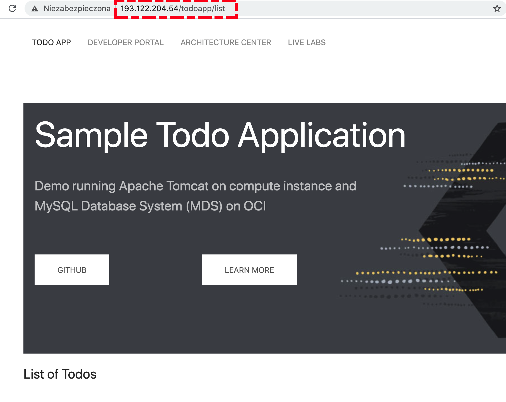
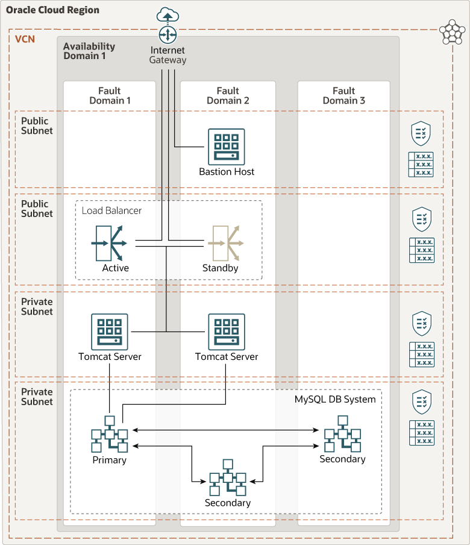

# terraform-oci-arch-tomcat-mds

Apache Tomcat® is an open source Java application server. It implements the Java Servlet, JavaServer Pages, Java Expression Language and Java WebSocket technologies.

MySQL Database Service is a fully-managed Oracle Cloud Infrastructure native service. It's developed, managed, and supported by the MySQL team at Oracle. Tasks such as backup and recovery, database and operating system patching, and so on are automated. You are responsible solely for managing your data, schema designs, and access policies.

For details of the architecture, see [_Deploy Apache Tomcat connected to MySQL Database Service_](https://docs.oracle.com/en/solutions/deploy-tomcat-mysql/index.html)

## Prerequisites

- Permission to `manage` the following types of resources in your Oracle Cloud Infrastructure tenancy: `vcns`, `internet-gateways`, `route-tables`, `network-security-groups`, `subnets`, `mysql-family`, and `instances`.

- Quota to create the following resources: 1 VCN, 3 subnets, 1 Internet Gateway, 1 NAT Gateway, 2 route rules, 1 MDS instance, and 2 compute instances for TomcatVMs, 1 compute instance for BastionHost or 1 Bastion Service instead. 

If you don't have the required permissions and quota, contact your tenancy administrator. See [Policy Reference](https://docs.cloud.oracle.com/en-us/iaas/Content/Identity/Reference/policyreference.htm), [Service Limits](https://docs.cloud.oracle.com/en-us/iaas/Content/General/Concepts/servicelimits.htm), [Compartment Quotas](https://docs.cloud.oracle.com/iaas/Content/General/Concepts/resourcequotas.htm).

## Deploy Using Oracle Resource Manager

1. Click [](https://cloud.oracle.com/resourcemanager/stacks/create?region=home&zipUrl=https://github.com/oracle-devrel/terraform-oci-arch-tomcat-mds/releases/latest/download/terraform-oci-arch-tomcat-mds-stack-latest.zip)

    If you aren't already signed in, when prompted, enter the tenancy and user credentials.

2. Review and accept the terms and conditions.

3. Select the region where you want to deploy the stack.

4. Follow the on-screen prompts and instructions to create the stack.

5. After creating the stack, click **Terraform Actions**, and select **Plan**.

6. Wait for the job to be completed, and review the plan.

    To make any changes, return to the Stack Details page, click **Edit Stack**, and make the required changes. Then, run the **Plan** action again.

7. If no further changes are necessary, return to the Stack Details page, click **Terraform Actions**, and select **Apply**. 

## Deploy Using the Terraform CLI

### Clone the Module

Now, you'll want a local copy of this repo. You can make that with the commands:

```
    git clone https://github.com/oracle-devrel/terraform-oci-arch-tomcat-mds.git
    cd terraform-oci-arch-tomcat-mds
    ls
```

### Prerequisites
First off, you'll need to do some pre-deploy setup.  That's all detailed [here](https://github.com/cloud-partners/oci-prerequisites).

Create a `terraform.tfvars` file, and specify the following variables:

```
# Authentication
tenancy_ocid         = "<tenancy_ocid>"
user_ocid            = "<user_ocid>"
fingerprint          = "<finger_print>"
private_key_path     = "<pem_private_key_path>"

# Region
region = "<oci_region>"

# Compartment
compartment_ocid = "<compartment_ocid>"

# Number of Tomcat nodes (optional)
numberOfNodes = 2

# MySQL DBSystem Admin Password 
mysql_db_system_admin_password = "<mysql_db_system_admin_password>"

# MySQL DBSystem Password 
mysql_db_system_password = "<mysql_db_system_password>"

````

### Create the Resources
Run the following commands:

    terraform init
    terraform plan
    terraform apply


### Testing your Deployment
After the deployment is finished, you can test that your Tomcat was deployed correctly and can access the tomcat demo application with MDS as database system. Pick up the value of the todoapp_url:

````
todoapp_url = http://193.122.204.54/todoapp/list
`````

Then copy it into Web browser. Here is the example of the succesfull outcome:



As the load balancer alternates between the 2 Tomcat nodes, the session data should persist.

### Destroy the Deployment
When you no longer need the deployment, you can run this command to destroy the resources:

    terraform destroy

## Architecture Diagram



## Contributing
This project is open source.  Please submit your contributions by forking this repository and submitting a pull request!  Oracle appreciates any contributions that are made by the open source community.

### Attribution & Credits
Initially, this project was created and distributed in [GitHub Oracle QuickStart space](https://github.com/oracle-quickstart/oci-arch-tomcat-mds). For that reason, we would like to thank all the involved contributors enlisted below:
- Lukasz Feldman (https://github.com/lfeldman)
- Jeevan Joseph (https://github.com/jeevanjoseph)
- Orlando Gentil (https://github.com/oegentil)
- Ben Lackey (https://github.com/benofben) 
- Nuno Gonçalves (https://github.com/nugoncal)

## License
Copyright (c) 2024 Oracle and/or its affiliates.

Licensed under the Universal Permissive License (UPL), Version 1.0.

See [LICENSE](LICENSE.txt) for more details.
